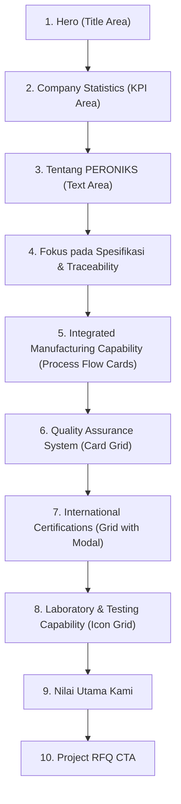

# Information Architecture – About Page Revamp (Final)

This document details the final approved structure, capability mappings, certification asset sourcing, and future roadmaps for the revamped **About** (Company Profile) page of PERONIKS.

---

## 1. Page Hierarchy

The revamped page merges company overview, physical manufacturing pipelines, quality management standards, local compliance assets, and laboratory testing setups into a singular, high-credibility narrative structure.



---

## 2. Section Descriptions & Mappings

### A. Company Statistics Grid
- **Position**: Directly below the Hero section title block, preceding the "Tentang PERONIKS" text blocks.
- **Factual Claims**:
  - `1997` – Founded (Taiwanese foreign investment start)
  - `27+` – Years Experience
  - `ISO 9001:2015` – Quality Management Standard Registered
  - `100%` – Material Traceability (full audit traceability)

### B. Integrated Manufacturing Capability
- **Design Pattern**: Process Flow Cards.
- **Mapping of Manufacturing Flow**:
  1. **Mold Development** (Pengembangan cetakan)
  2. **Casting** (Pengecoran logam)
  3. **CNC Machining** (Permesinan CNC presisi)
  4. **Heat Treatment** (Perlakuan panas)
  5. **Inspection** (Inspeksi teknis)
  6. **Packaging** (Pengemasan produk)

### C. Quality Assurance System
- **Layout**: 2-column card grid containing key quality metrics with distinct icons:
  - **ISO 9001:2015** (Icon: `workspace_premium`)
  - **Material Traceability** (Icon: `history`)
  - **Incoming Inspection** (Icon: `input`)
  - **In-Process Inspection** (Icon: `pending_actions`)
  - **Final Inspection** (Icon: `assignment_turned_in`)
  - **Continuous Improvement** (Icon: `trending_up`)

### D. International Certifications
- **Interactivity**: 4-column responsive grid where clicking a certificate card displays a dark-overlay backdrop modal with blur effects, allowing closing via X-button, ESC key, or clicking outside.
- **Asset Mapping**:
  All files are saved locally inside [public/images/company/certifications/](file:///d:/project/TRAE%20AI/peroniks-site/public/images/company/certifications/).

  | Filename | Source URL on Official Peroniks Server | Certificate Title |
  | :--- | :--- | :--- |
  | `iso9001.jpg` | `https://peroniks.com/images/isoimages/37438-Sertifikat%20ISO%20PERONI%202023-2026.jpg` | ISO 9001:2015 Certification |
  | `ped2014.jpg` | `https://peroniks.com/images/isoimages/6f921-Q-25%200002-00_Main_EN_extsigned_page-0001.jpg` | PED 2014/68/EU Compliance |
  | `reach-ss.jpg` | `https://peroniks.com/images/isoimages/c8e34-REACH%20Analysis%20of%20SS%20Flange-Fitting-Valve.jpg` | REACH Compliance (Stainless Steel) |
  | `reach-al.jpg` | `https://peroniks.com/images/isoimages/558db-Report%20of%20Aluminium%20Flanges%20Analysis%20according%20to%20REACH.jpg` | REACH Compliance (Aluminium) |
  | `rohs-ss.jpg` | `https://peroniks.com/images/isoimages/89ff3-ROHS%20CERTIFICATE%20-%202019.05.02%20-STAINLESS%20STEEL.jpg` | RoHS Compliance (Stainless Steel) |
  | `rohs-al.jpg` | `https://peroniks.com/images/isoimages/e41d2-ROHS%20CERTIFICATE%20-%202019.05.02%20-ALUMINIUM.jpg` | RoHS Compliance (Aluminium) |
  | `hydro-ball-valve.jpg` | `https://peroniks.com/images/isoimages/4d4fb-HYDROSTATIC%20TEST%20-%202-PC%20BALL%20VALVE%20REPORT%20%28MERGED%20JPG%29.jpg` | Hydrostatic Test (Ball Valve) |
  | `hydro-elbow.jpg` | `https://peroniks.com/images/isoimages/eaedf-HYDROSTATIC%20TEST%20-%20ELBOW%2090%20FF%20REPORT%20%28MERGED%20JPG%29.jpg` | Hydrostatic Test (Elbow) |
  | `hydro-hex-nipple.jpg` | `https://peroniks.com/images/isoimages/d6618-HYDROSTATIC%20TEST%20-%20HEX%20NIPPLE%20REPORT%20%28MERGED%20JPG%29.jpg` | Hydrostatic Test (Hex Nipple) |
  | `hydro-union.jpg` | `https://peroniks.com/images/isoimages/f7430-HYDROSTATIC%20TEST%20-%20UNION%20CONICAL%20FF%20REPORT%20%28MERGED%20JPG%29.jpg` | Hydrostatic Test (Union Conical) |

### E. Laboratory & Testing Capability
- **Design Pattern**: Brief intro description followed by a grid of 6 icon cards:
  - **PMI** (Icon: `science`)
  - **Chemical Analysis** (Icon: `biotech`)
  - **Mechanical Test** (Icon: `fitness_center`)
  - **Hydrostatic Test** (Icon: `water_drop`)
  - **Dimensional Inspection** (Icon: `straighten`)
  - **MTC 3.1** (Icon: `article`)

---

## 3. Future Roadmap

```
Phase 5A: Company Profile & Quality Assurance
  ├── [x] Integrated Manufacturing Flow (Process Cards)
  ├── [x] Quality Assurance System
  ├── [x] Local Certificates Gallery & Lightbox Viewer
  └── [x] Laboratory & Testing Capabilities

Phase 5B: Media & Location Gallery
  ├── [x] High-Resolution Factory Hero Background Image (Phase 6A Evaluation)
  ├── [ ] High-Resolution Factory Gallery
  ├── [ ] Production Line Slideshow
  ├── [ ] Quality Lab Walkthrough Photos
  └── [ ] Warehouse & Office Facility Showcases

Phase 5C: Interactive Company History
  ├── [ ] Interactive Timeline Slider (1997 - Present)
  ├── [ ] Taiwanese Investment Milestones
  ├── [ ] ISO Integration & Standard Compliance Roadmap
  └── [ ] Domestic and Global Export Footprint Expansion
```
